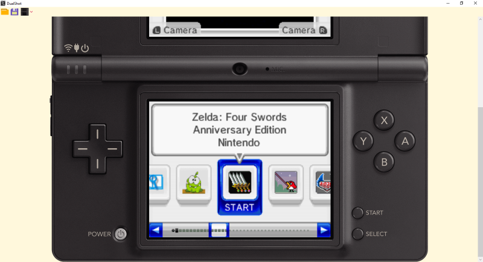
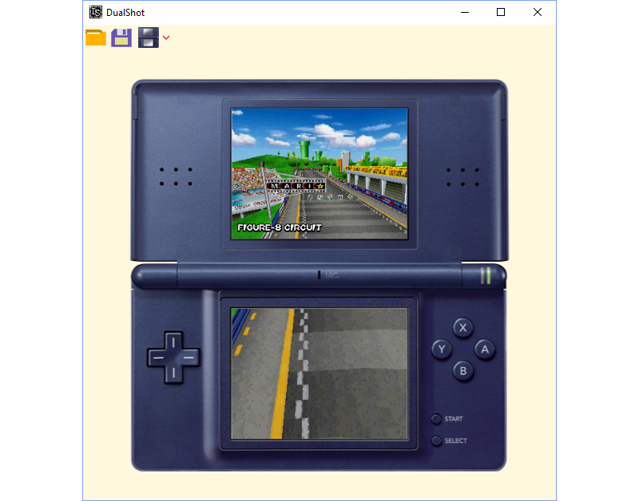
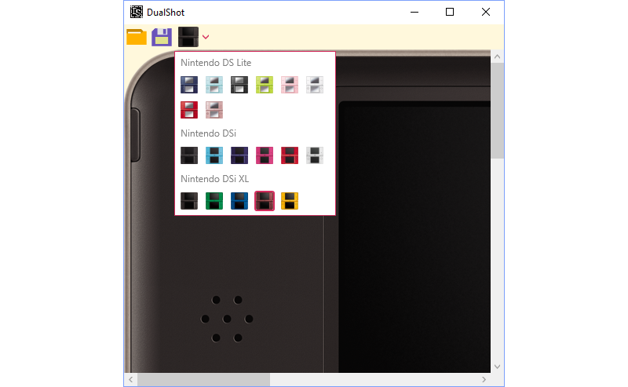

# DualShot V0.1
Console frame wrap around DS emulator screenshot 

Beautify your DS screenshots by making it seem you took a perfect picture of the DS while playing

This tool uses a basic load/save system. Perhaps it will become more complex in the future. 
A command line interface will be added in the next versions.

Please ensure that your image size in pixels is a multiple of 256x384. DualShot will cut it in half without any verification,
so using another aspect ratio will result in stretched images on the DS screens. 

*Damnnn it's so satisfying to look at all these pictures*

Image source for all DS's: https://bulbapedia.bulbagarden.net/wiki/Category:Nintendo_consoles